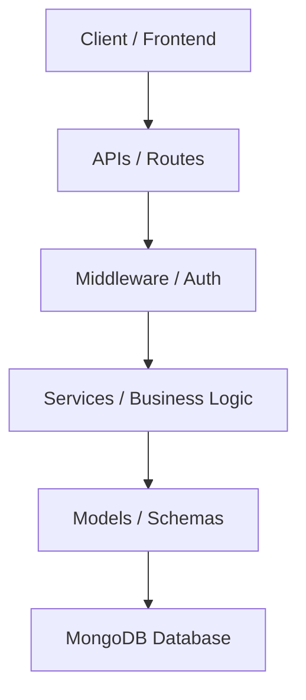
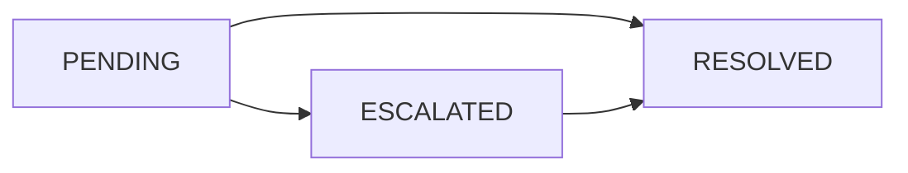

### Automated Complaint Escalation - Banking System Backend

---

### Project Overview

The Automated Complaint Escalation Banking System is a backend solution for role-based complaint management in banking or enterprise environments. The system enables users to register, log in, and raise complaints, while administrators and support agents can monitor, manage, and escalate complaints efficiently.

It demonstrates real-world backend features like authentication, authorization, complaint categorization, audit-friendly status history, analytics, soft deletion, and workflow management.

---

## Problem Statement

In large organizations, customer complaints often face delays due to the absence of structured tracking, role-based visibility, and status monitoring. This results in poor resolution times and decreased customer satisfaction.

There is a need for a centralized system that:

1. Provides a platform for users to raise complaints easily.
2. Enables administrators and support agents to monitor and manage complaints.
3. Tracks complaint status, priority, category, and full status history.
4. Provides dashboard insights for operational visibility.
5. Uses structured role-based access control, authentication, and authorization.

---

## Features

### User Features

1. User Registration and Login: Secure JWT-based authentication.
2. Raise Complaints: Submit complaints with category and priority levels.
3. View My Complaints: Track complaint status and complete status history.
4. Soft Delete: Delete complaints without permanently removing records.

### Admin and Support Agent Features

1. Role-Based Access: `ADMIN` and `SUPPORT_AGENT` roles can manage complaint workflows.
2. View All Complaints: Paginated access to all active complaints.
3. Update Complaint Status: Change status to `PENDING`, `ESCALATED`, or `RESOLVED`.
4. Status History: Every status change is stored in a complaint timeline.
5. Dashboard Analytics: View totals and breakdowns by status, category, and priority.
6. Search and Filter: Search by title, category, or status and filter by status, category, or priority.
7. Priority Ordering: High-priority complaints are shown first.
8. Email Notification Simulation: Status changes log a simulated email notification.

### Professional Backend Upgrades

1. Complaint timeline/status history for audit tracking.
2. Complaint categories: `ATM`, `LOAN`, `CREDIT_CARD`, `NET_BANKING`, `UPI`, `FRAUD`.
3. Soft delete support for compliance-friendly data retention.
4. Paginated complaint APIs for scalability.
5. Dashboard analytics for business insight.
6. In production, rate limiting and request validation should be added to prevent API abuse.

---

## Tech Stack

- Backend: Node.js, Express.js
- Database: MongoDB with Mongoose ODM
- Authentication: JWT
- Password Security: bcrypt for hashing passwords

---

## API Endpoints

### Auth Routes

- `POST /api/auth/register` - Register a new user.
- `POST /api/auth/login` - Authenticate and retrieve a JWT token.

### User Routes

- `POST /api/complaints` or `POST /api/complaints/create` - Raise a new complaint.
- `GET /api/complaints/my?page=1&limit=5` - View logged-in user's complaints.
- `GET /api/complaints/search?keyword=ATM&page=1&limit=5` - Search visible complaints.
- `GET /api/complaints/filter?status=PENDING&category=UPI&priority=HIGH` - Filter visible complaints.
- `DELETE /api/complaints/:id` - Soft delete a visible complaint.

### Admin and Support Agent Routes

- `GET /api/complaints?page=1&limit=5` or `GET /api/complaints/all?page=1&limit=5` - View all active complaints.
- `PUT /api/complaints/status/:id` - Update complaint status.
- `GET /api/complaints/dashboard` - Get complaint analytics.

---

## Complaint Fields

Example complaint creation body:

```json
{
  "title": "UPI payment failed",
  "description": "Money was debited but the merchant did not receive it.",
  "category": "UPI",
  "priority": "HIGH"
}
```

Example status history:

```json
[
  {
    "status": "PENDING",
    "updatedAt": "2026-05-26T10:00:00.000Z"
  },
  {
    "status": "ESCALATED",
    "updatedAt": "2026-05-26T11:00:00.000Z"
  }
]
```

---

## System Architecture & Directory Structure

The project follows a standard modular, layered architecture to separate concerns and ensure maintainability:

- **APIs**: Handle routing, HTTP request/response parsing, and controller mapping.
- **Services**: Contain the core business logic, validation rules, and database operations.
- **Models**: Define the MongoDB schemas and data structures using Mongoose.
- **Middleware**: Intercept requests to handle cross-cutting concerns like authentication and authorization.

### Directory Structure

```text
AUTOMATED_COMPLAINT_ESCALATION/
├── BACKEND/                    # Backend Node.js / Express Application
│   ├── APIS/                   # API Route Definitions
│   │   ├── AuthAPI.js          # Authentication Endpoints
│   │   └── ComplaintAPI.js     # Complaint Operations Endpoints
│   ├── middlewares/            # Custom Middleware Functions
│   │   ├── adminOnly.js        # Restricts access to ADMIN/SUPPORT roles
│   │   └── verifyToken.js      # Validates JWT tokens on protected routes
│   ├── models/                 # Mongoose Database Schemas
│   │   ├── complaintModel.js   # Complaint Schema & Priority/Status Hooks
│   │   └── userModel.js        # User Schema & Role Definition
│   ├── services/               # Core Business Logic & DB Operations
│   │   ├── authService.js      # User Registration & Login Service
│   │   └── complaintService.js # CRUD & Workflow Management Service
│   ├── server.js               # Application Entry Point & DB Connection
│   └── package.json            # Node.js Project Dependencies
│
├── FRONTEND/                   # Frontend React Application (Vite + Tailwind)
│   ├── src/
│   │   ├── components/         # Reusable UI Components
│   │   ├── context/            # React Context (Auth, Toast, etc.)
│   │   ├── pages/              # Page Components
│   │   │   ├── LoginPage.jsx
│   │   │   ├── RegisterPage.jsx
│   │   │   ├── CreateComplaintPage.jsx
│   │   │   ├── UserComplaintsPage.jsx
│   │   │   ├── AdminComplaintsPage.jsx
│   │   │   └── AdminDashboardPage.jsx
│   │   ├── App.jsx             # Main App Router & Layout
│   │   └── main.jsx            # Application Entry Point
│   ├── tailwind.config.js      # Tailwind CSS Configuration
│   └── package.json            # Frontend Dependencies & Scripts
```

### Architecture Diagram



---

## Security Features

Security is integrated at multiple layers of the system to protect sensitive user and system data:

* **JWT-Based Authentication**: Stateless authentication utilizing JSON Web Tokens for secure session management.
* **Password Hashing**: Industry-standard password hashing using `bcrypt` to secure user passwords in storage.
* **Protected Routes**: Restricting API endpoint access exclusively to authenticated requests.
* **Role-Based Authorization (RBAC)**: Fine-grained access control where specific capabilities are locked to designated roles (`USER`, `SUPPORT_AGENT`, `ADMIN`).
* **Middleware-Based Access Control**: Centralized route guards enforcing authentication and roles before logic execution.

---

## Complaint Status Workflow

Every complaint moves through a structured progression from creation to resolution, fully tracked in the status audit history.



---

## Future Enhancements

- **Real Email Notifications**: Integrating `nodemailer` with Gmail SMTP to notify users of real-time complaint status updates.
- **SLA Automatic Escalation**: Scheduled background cron jobs to automatically escalate pending complaints if unresolved after a set SLA duration.
- **Advanced Dashboard Graphs**: Interactive analytics charts for admin reporting (using Recharts or Chart.js on the frontend).
- **Two-Factor Authentication (2FA)**: Adding an extra layer of security for administrative accounts.
- **Attachment Support**: Allowing users to upload screenshots or documents related to their complaints.
