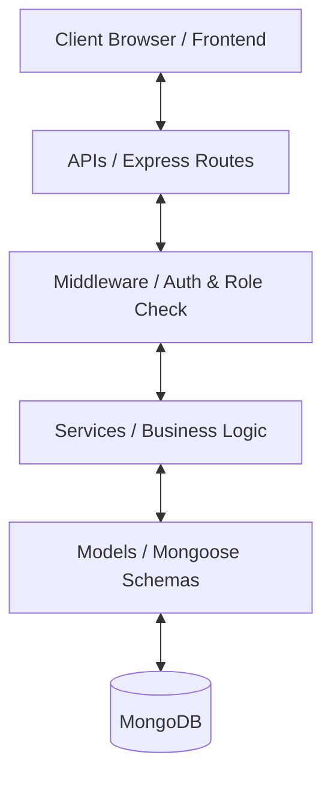
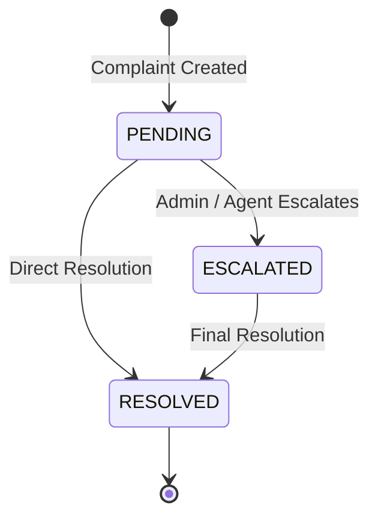

### FinResolve – Automated Banking Complaint Escalation System
A scalable role-based banking complaint management backend system designed to streamline complaint tracking, escalation workflows, and administrative monitoring in enterprise environments.
---

### Project Overview

The Automated Complaint Escalation-Banking System is a backend solution for role-based complaint management in banking or enterprise environments. The system enables users to register, log in, and raise complaints, while administrators can monitor, manage, and escalate complaints efficiently. It demonstrates real-world features like authentication, authorization, and workflow management to ensure timely resolution and operational transparency.

---

## Problem Statement

In large organizations, customer complaints often face delays due to the absence of structured tracking, role-based visibility, and status monitoring. This results in poor resolution times and decreased customer satisfaction

There is a need for a centralized system that:

    1. A platform for users to raise complaints easily.

    2. Enables administrators to monitor and manage complaints

    3. Tracks complaint status and priority.

    4. Provides dashboard insights for operational visibility

    5. A structured workflow with role-based access control, authentication, and authorization.

# Features

User Features 
    1. User Registration & Login: (Secure JWT-based authentication.)

    2. Raise Complaints: Submit complaints with priority levels (LOW, MEDIUM, HIGH).

    3. View My Complaints: Users can track the status of their own complaints

Admin Features
    1. Admin Login & Role-Based Access: Only administrators can access management features.

    2.  View All Complaints: Complete visibility over all complaints in the system.

    3.  Update Complaint Status: Change status to PENDING, ESCALATED, or RESOLVED.

    4.  Dashboard Statistics: View total complaints and breakdown by status.

    5.  Search & Filter: Find complaints by keywords or filter by status.

---

# Tech Stack

- Backend: Node.js, Express.js
- Database: MongoDB with Mongoose ODM
- Authentication: JWT (JSON Web Tokens)
- Password Security: bcrypt for hashing passwords

---

### API Endpoints
Auth Routes
    - POST /api/auth/register – Register a new user.
    - POST /api/auth/login – Authenticate and retrieve a JWT token.

User Routes
    -  POST /api/complaints – Raise a new complaint.
    -  GET /api/complaints/me – View logged-in user’s complaints.

Admin Routes
    -  GET /api/complaints – View all complaints.
    -  PUT /api/complaints/:id/status – Update complaint status.
    -  GET /api/complaints/search?query=... – Search complaints by keyword.
    -  GET /api/complaints/filter?status=... – Filter complaints by status.
    -  GET /api/dashboard – Get complaint statistics (total, pending, escalated, resolved).

---

## System Architecture

The project follows a standard modular, layered architecture to separate concerns and ensure maintainability:

- **APIs**: Handle routing, HTTP request/response parsing, and controller mapping.
- **Services**: Contain the core business logic, validation rules, and database operations.
- **Models**: Define the MongoDB schemas and data structures using Mongoose.
- **Middleware**: Intercept requests to handle cross-cutting concerns like authentication and authorization.

---

## Security Features

Security is integrated at multiple layers of the system to protect sensitive user and system data:

* **JWT-Based Authentication**: Stateless authentication utilizing JSON Web Tokens for secure session management.
* **Password Hashing**: Industry-standard password hashing using `bcrypt` to secure user passwords in storage.
* **Protected Routes**: Restricting API endpoint access exclusively to authenticated requests.
* **Role-Based Authorization (RBAC)**: Fine-grained access control where specific capabilities are locked to designated roles (`USER`, `SUPPORT_AGENT`, `ADMIN`).
* **Middleware-Based Access Control**: Centralized route guards enforcing authentication and roles before logic execution.

---

## Complaint Status Workflow

Every complaint moves through a structured progression from creation to resolution, fully tracked in the status audit history.

---

## Future Enhancements

- **Real Email Notifications**: Integrating `nodemailer` with Gmail SMTP to notify users of real-time complaint status updates.
- **SLA Automatic Escalation**: Scheduled background cron jobs to automatically escalate pending complaints if unresolved after a set SLA duration.
- **Advanced Dashboard Graphs**: Interactive analytics charts for admin reporting (using Recharts or Chart.js on the frontend).
- **Two-Factor Authentication (2FA)**: Adding an extra layer of security for administrative accounts.
- **Attachment Support**: Allowing users to upload screenshots or documents related to their complaints.
